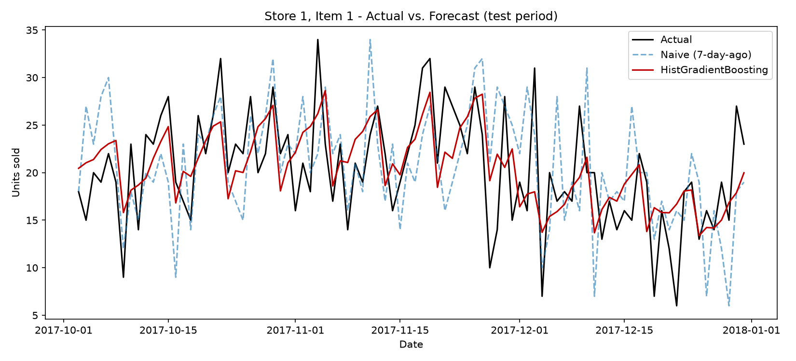
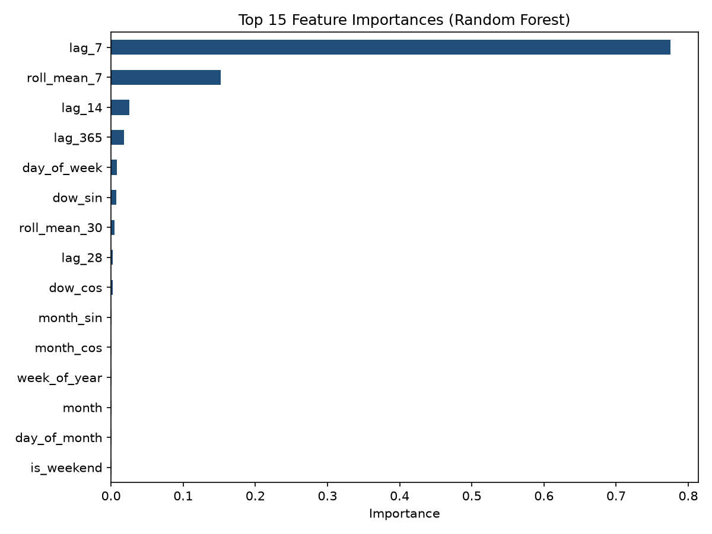

# Demand Forecasting for Supply Chain Planning

Predicts daily unit demand per store/SKU to support safety-stock sizing and
replenishment planning — the same problem underlying inventory and logistics
optimization in a supply chain function.

## Business problem

Under-forecasting demand causes stockouts; over-forecasting ties up capital
in excess inventory. Both cost real money. This project builds and compares
forecasting approaches, then translates forecast accuracy into inventory
impact rather than stopping at a raw error metric.

## Data

[Kaggle: Store Item Demand Forecasting Challenge](https://www.kaggle.com/competitions/demand-forecasting-kernels-only) —
5 years (2013–2017) of daily sales for 50 items across 10 stores
(913,000 rows, no missing values). The task mirrors real replenishment
forecasting: predict future daily demand per (store, item) using only
historical data.

## Method

- **Time-based train/test split** (last 90 days held out) — never a random
  split, since that would leak future information into training.
- **Feature engineering** (`src/features.py`): calendar features (day of
  week, month, cyclical encodings, month/week-of-year), lag features
  (7/14/28/90/365 days), and rolling mean/std (7/30/90-day windows).
  All rolling/lag features are shifted so no feature ever sees the value
  it's predicting — this is the most common way these pipelines silently
  leak and inflate accuracy.
- **Baselines**: naive (same day, 7 days prior) and 30-day moving average —
  established first so the ML models have something honest to beat.
- **Models**: Random Forest and HistGradientBoosting (scikit-learn's
  histogram-based GBM, the same family as LightGBM/XGBoost, and the one
  that generally wins on tabular retail-demand data).
- **Evaluation** (`src/metrics.py`): RMSE/MAE plus **WMAPE** (volume-weighted
  MAPE — the standard metric demand planners use, since a flat MAPE over-
  weights low-volume SKUs) and **bias** (systematic over/under-forecasting,
  which drives whether you carry excess stock or run stockout risk).

## Results

| Model | RMSE | MAPE % | WMAPE % | Bias % |
|---|---|---|---|---|
| Naive (7-day-ago) | 12.05 | 19.90 | 16.60 | +2.31 |
| Moving Average (30-day) | 12.62 | 21.23 | 17.52 | +5.18 |
| Random Forest | 8.40 | 14.14 | 11.74 | +0.94 |
| **HistGradientBoosting** | **7.68** | **13.00** | **10.85** | **-0.26** |

HistGradientBoosting cuts WMAPE by **~35% relative to the naive baseline**,
and its bias is nearly zero (vs. the moving-average baseline's persistent
+5% over-forecast, which is exactly the pattern that quietly builds up
excess inventory).

**Business read:** required safety stock scales roughly with forecast error
(standard deviation of error over the replenishment lead time). A ~35%
reduction in WMAPE implies a comparable reduction in the safety stock needed
to hit the same service level — i.e., freeing up working capital without
increasing stockout risk, holding lead-time variability constant.




The feature importance plot confirms the model leans most on recent lags
and rolling averages (i.e., recent demand momentum) with day-of-week /
seasonal terms as secondary signal — consistent with how demand planners
already think about the problem, which is a good sanity check that the
model learned something sensible rather than something spurious.

## Project structure

```
demand_forecasting/
├── data/train.csv          # Kaggle Store Item Demand Forecasting dataset
├── src/
│   ├── features.py         # calendar + lag + rolling feature engineering
│   ├── metrics.py           # RMSE/MAE/MAPE/WMAPE/bias
│   └── train.py             # full pipeline: split, baselines, models, plots
├── outputs/
│   ├── metrics.json
│   ├── forecast_plot.png
│   └── feature_importance.png
└── requirements.txt
```

## Run it

```bash
pip install -r requirements.txt
python src/train.py
```

## Notes / limitations

- Single global model across all (store, item) pairs, using store/item as
  categorical features — chosen over 500 separate per-series models for
  simplicity and because tree models handle this pooling well; a per-series
  or hierarchical approach (e.g. store → category → item) is a natural
  next step and often improves accuracy further on low-volume SKUs.
- No external regressors (promotions, price, weather) — the raw dataset
  doesn't include them. In a real deployment, these are usually the biggest
  accuracy lever beyond calendar/lag features.
- Compute here was constrained to a single CPU core, which is why model
  sizes (tree count/depth) are modest — the same pipeline scales directly
  with more compute or a managed cloud training job (e.g., SageMaker/Vertex
  AI/Azure ML), which is the natural extension for a production setting.
